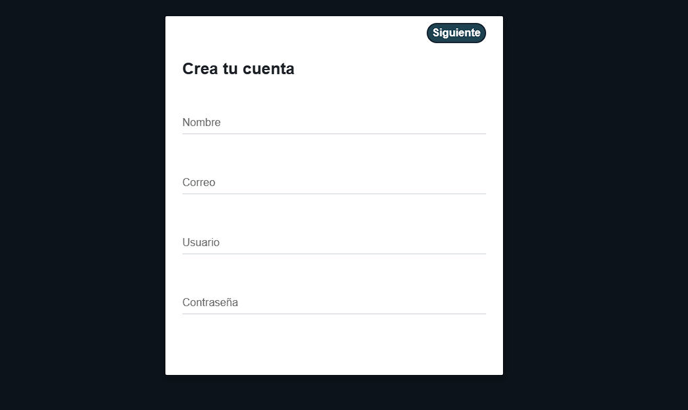

# 
Red social de imágenes

## Página principal

## Registro de cuenta (ruta: /registrarse)
Para crear la cuenta es necesario rellenar todos los campos del formulario. Si el usuario o el correo ya han sido registrados, se muestra otra vez la página de registro con un mensaje indicando que el usuario no está disponible o el correo ha sido registrado. Si es un usuario completamente nuevo, se verifica el formato del email. Para la contraseña es necesario tener *al menos una mayúscula y un número*.

El usuario tiene 10 minutos para acceder a este link y, una vez ingrese, se indica un mensaje con la activación exitosa y la actualización en la base de datos. Si no accede en este tiempo, el enlace deja de ser funcional enviando un mensaje que ha expirado.

## Inicio de sesión (ruta: /Iniciosesion)

## Olvidar contraseña (ruta: /Olvidar)

Si el correo existe en la base de datos, se envía un correo desde Python gracias a la librería *yagmail*, utilizando una cuenta previamente creada para esta función y que también se utiliza para enviar un mensaje al crear la cuenta exitosamente. Al enviar la cuenta, la función redirige a la plantilla de Iniciar sesión.

Al igual que en la confirmación del correo al crear una nueva cuenta, este enlace tiene una duración de 10 minutos.

## Perfil (ruta: /perfil)

Se puede acceder a la galería, descargar las imágenes públicas con un clic y buscar por palabras claves las imágenes públicas que contengan esa palabra clave en el nombre.

## Galería (ruta: /Galeria)

Permite subir nuevas imágenes al perfil, cambiar el estado de pública a privada, además de borrar imágenes.

# 
Diagrama de la base de datos

